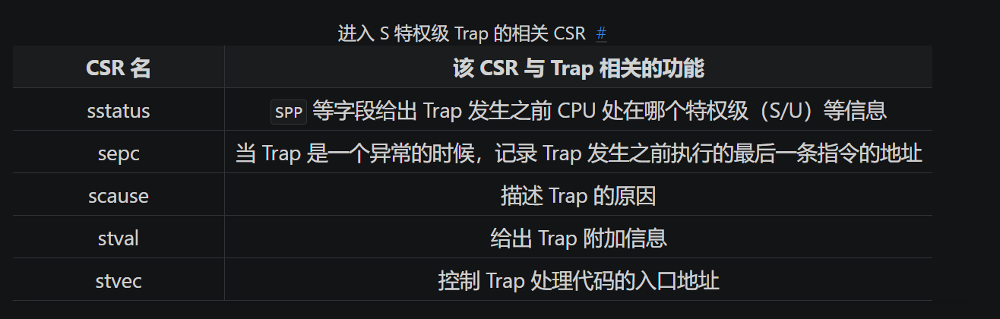

# 特权级机制

+ 特权级的软硬件协同设计
  
  实现特权级机制的根本原因是应用程序运行的安全性不可充分信任，在上一章里，操作系统以库的形式和应用紧密连接在一起，构成一个整体来执行，随着应用需求的增加，操作系统的体积也越来越大，同时应用自身也会越来越复杂，由于操作系统会被频繁访问，来给多个应用提供服务，所以他的错误会比较快地被发现，但应用自身的错误可能就不会很快发现，由于二者通过编译器形成一个单一执行程序来执行，导致即使是应用本身的问题，也会让操作系统受到连累，从而可能导致整个计算机系统都不可用了

  为确保操作系统的安全，对应用程序而言，需要限制的主要有两个方面：
  
  + 应用程序不能访问任意的地址空间
  + 应用程序不能执行某些可能破坏计算机系统的指令

  同时为了确保应用程序能够得到操作系统的服务，那么应用程序和操作系统还需要有交互的手段，因此引用一种特权级机制，将高特权软件作为低特权软件执行环境的一部分

  为了实现这样的特权级机制，需要进行软硬件协同设计，一个比较简洁的方法就是，**处理器设置两个不同安全等级的执行环境**，用户态特权级的执行环境和内核态特权级的执行环境，**且明确指出可能破坏计算机系统的内核态特权级指令子集**，处理器在执行指令之前都会进行特权级安全检查，如果在用户态执行环境中执行这些内核态特权指令，就会抛出异常

  为此RISC-V提供了相应的机器指令：**执行环境调用指令ecall**和**一类执行环境返回指令eret（其中包括sret和mret）**

  + `ecall` 具有从用户态到内核态的执行环境切换能力
  + `sret` 具有内核态到用户态的执行环境切换能力
  + `mret` 具有从机器态到内核态的执行环境切换能力
  
  除了上述机制外，还需要操作系统的配合才能最终完成对操作系统自身的保护，首先在执行 `sret` 前需要准备和恢复用户态执行应用程序的上下文，其次，在应用程序调用 `ecall` 指令之后，能够检查应用程序的系统调用参数，确保参数不会破坏操作系统

+ RISC-V特权架构
  
  RISC-V架构中一共定义了四种特权级：

    | 级别 | 编码 | 名称  |
    |------|------|------|
    | 0 | 00 | 用户模式(U, User) |
    | 1 | 01 | 监督模式(S, Supervisor) |
    | 2 | 10 | 虚拟监督模式(H, Hypervisor)(尚未完善，不讨论) |
    | 3 | 11 | 机器模式(M, Machine) |

  其中级别的数值越大，特权级越高，掌控硬件的能力就越强，从表中可以看出，M模式处在最高的特权级，而U模式处在最低的特权级，本质上除了M模式必须存在，其他模式都可以不存在，下图给出了执行环境栈之间的关系：

  

  执行环境的另外一种功能就是对上层软件的执行进行监控管理，监控管理可以理解为，当上层软件执行的时候出现了一些异常或者特殊情况，导需要用到执行环境中提供的功能，因此需要暂停上层软件的执行，转而运行执行环境的代码，由于上层软件和执行环境被设计为运行在不同的特权级，这个过程也往往(**并非一定**)伴随着CPU的特权切换，当执行环境的代码运行结束之后，我们需要返回上层软件暂停的位置继续执行，在RISC-V架构中，这种与常规控制流（顺序、循环、分支、函数调用）不同的异常控制流被称之为异常，是RISC-V语境下的Trap种类之一

  用户态应用直接触发从用户态到内核态的异常的原因总体上分为两种：其一是用户态软件为获得内核态操作系统的服务功能而执行；其二是执行某条指令期间产生了错误并被CPU检测到

  

  其中断点和和执行环境调用两种异常（与其他非有意为之的异常区分）是通过在上层软件中执行一条特定的指令触发的：执行 `ebreak` 这条指令之后就会触发断电陷入异常；而执行 `ecall` 这条指令时候则会随着CPU当前特权级而触发不同的异常，即表中的 11/9/8 这三种，此外不同执行环境之间的接口都是**二进制接口**，是机器/汇编指令级的一种接口，这样才能满足跨高级语言的通用性和灵活性

  

+ 用户程序项目结构
  
  在`user/src`目录还有一个`bin`目录，里面有多个文件，其中一个文件对应一个应用程序，其中每个文件中都有这么一行代码：

  ```Rust
  #[macro_use]
  extern crate user_lib;
  ```

  这个外部库其实就是user目录下的lib.rs，以及它引用的若干子模块，至于为什么称之为user_lib而不叫lib.rs所在目录的名字user，是因为在user/Cargo.toml中我们对于库的名字进行了设置：`name = "user_lib"`，作为`bin`目录下的源程序所依赖的库，等价于其他编程语言提供的标准库

  其中在`lib.rs`中我们定义了用户库的入口点`_start`：

  ```Rust
  #[no_mangle]
  #[link_section = ".text.entry"]
  pub extern "C" fn _start() -> ! {
      clear_bss();
      exit(main());
      panic!("unreachable after sys_exit!");
  }
  ```

  第二行使用Rust的宏将`_start`这段代码放在一个名为`.text.entry`的代码段中，这是为了方便后续链接的时候调整它的位置使得它能够作为用户库的入口，第4行开始，进入用户库入口之后，和第一章一样，进行`.bss`段的初始化，然后调用`main`函数并退出

+ 内存布局
  
  同样使用链接脚本，主要做的是：

  + 将程序的起始物理地址调整为`0x80400000`，三个应用程序都会被加载到这个物理地址上运行；
  + 将`_start`所在的`.text.entry`放在整个程序的开头，因此会进入用户库的入口点，执行初始化之后跳转到应用程序的主逻辑
  
+ 将应用程序链接到内核
  
  为了把应用程序的二进制镜像文件作为内核的数据段链接到内核里，内核需要知道内含的应用程序的数量和它们的位置，这样才能够在运行时对它们进行管理并能够加载到物理内存中

  查看汇编代码`link_app.S`，其主要声明了每个程序的起始位置和结束位置，并插入了每个应用程序的镜像文件，最后将这些信息存入数组`_num_app`中

  在os的batch子模块中，实现了一个能够找到并加载应用程序二进制码的应用管理器`AppManager`，其数据定义如下：

  ```rust
  // os/src/batch.rs
  struct AppManager {
      num_app: usize,
      current_app: usize,
      app_start: [usize; MAX_APP_NUM + 1],
  }
  ```

  显然我们希望这个`AppManager`能够实例化为一个全局变量，使得任何函数都可以直接访问，但是里面的`current_app`字段表示当前执行的是第几个应用，这是一个可修改的变量，因此我们需要借助Rust中的内部可变性，这里我们可以使用`RefCell`去包裹我们的`AppManager`，但是`RefCell`并不能直接被声明为全局变量，这是因为Rust对于并发安全的检查较为粗糙，当声明一个全局变量的时候，编译器会默认程序会在多线程上使用它，而`RefCell`并未实现`Sync`，因此会被认为非线程安全的变量，从而停止编译

  如何解决？我们可以使用`UPSafeCell`，其含义是允许我们在单核上安全使用可变全局变量，查看源码可以看出`UPSafeCell`，实际上是对`RefCell`的一个简单的封装，只是更加严格，相比`RefCell`它不再允许多个读操作同时存在

  ```Rust
  // os/src/sync/up.rs

  pub struct UPSafeCell<T> {
      /// inner data
      inner: RefCell<T>,
  }

  unsafe impl<T> Sync for UPSafeCell<T> {}

  impl<T> UPSafeCell<T> {
      /// User is responsible to guarantee that inner struct is only used in
      /// uniprocessor.
      pub unsafe fn new(value: T) -> Self {
          Self { inner: RefCell::new(value) }
      }
      /// Panic if the data has been borrowed.
      pub fn exclusive_access(&self) -> RefMut<'_, T> {
          self.inner.borrow_mut()
      }
  }
  ```

  初始化`AppManager`的全局实例`APP_MANAGER`的代码如下：

  ```Rust
  // os/src/batch.rs

  lazy_static! {
      static ref APP_MANAGER: UPSafeCell<AppManager> = unsafe { UPSafeCell::new({
          extern "C" { fn _num_app(); }
          let num_app_ptr = _num_app as usize as *const usize;
          let num_app = num_app_ptr.read_volatile();
          let mut app_start: [usize; MAX_APP_NUM + 1] = [0; MAX_APP_NUM + 1];
          let app_start_raw: &[usize] =  core::slice::from_raw_parts(
              num_app_ptr.add(1), num_app + 1
          );
          app_start[..=num_app].copy_from_slice(app_start_raw);
          AppManager {
              num_app,
              current_app: 0,
              app_start,
          }
      })};
  }
  ```

  `lazy_static!`宏提供了全局变量的**运行时初始化功能**，只有当`APP_MANAGER`的全局实例第一次被用到时，才会进行实际的初始化工作，下面考察`load_app`方法：

  ```Rust
  unsafe fn load_app(&self, app_id: usize) {
      if app_id >= self.num_app {
          panic!("All applications completed!");
      }
      println!("[kernel] Loading app_{}", app_id);
      // clear app area
      core::slice::from_raw_parts_mut(
          APP_BASE_ADDRESS as *mut u8,
          APP_SIZE_LIMIT
      ).fill(0);
      let app_src = core::slice::from_raw_parts(
          self.app_start[app_id] as *const u8,
          self.app_start[app_id + 1] - self.app_start[app_id]
      );
      let app_dst = core::slice::from_raw_parts_mut(
          APP_BASE_ADDRESS as *mut u8,
          app_src.len()
      );
      app_dst.copy_from_slice(app_src);
      // memory fence about fetching the instruction memory
      asm!("fence.i");
  }
  ```

  其负责将应用程序的二进制镜像加载到物理内存以`0x80400000`的起始的位置，`fence.i`指令负责清空CPU中的指令缓存(i-cache)内容，以免访问到不合法的指令

+ 特权级切换相关的控制状态寄存器
  
  

+ 用户栈和内核栈
  
  在Trap触发的一瞬间，CPU就会切换到S特权级并跳转`stvec`所指示的指令位置，但是在正式进入S特权级的Trap处理前，我们必循保存原控制流的寄存器状态，注意我们需要专门为操作系统准备内核栈，而不是应用程序运行时用到的用户栈，这同时也是出于安全的考虑（如果用同一个栈，那么应用程序很可能会获取到内核栈的内容），这样会带来安全隐患，于是我们需要做的是，在批处理操作系统中添加一段汇编代码，实现从用户栈切换到内核栈，并在内核栈上保存应用程序的控制流和寄存器状态

  ```Rust
  // os/src/batch.rs

  const USER_STACK_SIZE: usize = 4096 * 2;
  const KERNEL_STACK_SIZE: usize = 4096 * 2;

  #[repr(align(4096))]
  struct KernelStack {
      data: [u8; KERNEL_STACK_SIZE],
  }

  #[repr(align(4096))]
  struct UserStack {
      data: [u8; USER_STACK_SIZE],
  }

  static KERNEL_STACK: KernelStack = KernelStack { data: [0; KERNEL_STACK_SIZE] };
  static USER_STACK: UserStack = UserStack { data: [0; USER_STACK_SIZE] };
  ```

  因此换栈的操作就是获取内核栈或者用户栈的栈顶，并将`sp`寄存器的值修改为栈顶即可

  接下来便是Trap上下文，即在Trap发生时候需要保存的物理资源内容：

  ```Rust
  // os/src/trap/context.rs

  #[repr(C)]
  pub struct TrapContext {
      pub x: [usize; 32],
      pub sstatus: Sstatus,
      pub sepc: usize,
  }
  ```

+ Trap管理
  
  特权级切换的核心是对Trap的管理：
  
  + 应用程序通过`ecall`进入到内核态时，操作系统保存被打断的应用程序的Trap上下文
  + 操作系统根据Trap相关CSR寄存器内容，完成对系统调用的分发和处理
  + 完成系统调用服务之后，需要恢复被打断的应用程序的Trap上下文，并通过`sret`让应用程序继续执行
  
  Trap上下文保存和恢复的汇编代码保存在`trap.S`：

  ```s
  # os/src/trap/trap.S

  .macro SAVE_GP n
      sd x\n, \n*8(sp)
  .endm

  .align 2
  __alltraps:
      csrrw sp, sscratch, sp
      # now sp->kernel stack, sscratch->user stack
      # allocate a TrapContext on kernel stack
      addi sp, sp, -34*8
      # save general-purpose registers
      sd x1, 1*8(sp)
      # skip sp(x2), we will save it later
      sd x3, 3*8(sp)
      # skip tp(x4), application does not use it
      # save x5~x31
      .set n, 5
      .rept 27
          SAVE_GP %n
          .set n, n+1
      .endr
      # we can use t0/t1/t2 freely, because they were saved on kernel stack
      csrr t0, sstatus
      csrr t1, sepc
      sd t0, 32*8(sp)
      sd t1, 33*8(sp)
      # read user stack from sscratch and save it on the kernel stack
      csrr t2, sscratch
      sd t2, 2*8(sp)
      # set input argument of trap_handler(cx: &mut TrapContext)
      mv a0, sp
      call trap_handler
  ```

  上述代码会将Trap上下文保存在内核栈上，同时还会切换用户栈和内核栈，最后它会调用trap_handler，并将Trap上下文作为参数保存在`a0`中

  `trap_handler`函数用于完成分发和处理：
  ```Rust
  // os/src/trap/mod.rs

  #[no_mangle]
  pub fn trap_handler(cx: &mut TrapContext) -> &mut TrapContext {
      let scause = scause::read();
      let stval = stval::read();
      match scause.cause() {
          Trap::Exception(Exception::UserEnvCall) => {
              cx.sepc += 4;
              cx.x[10] = syscall(cx.x[17], [cx.x[10], cx.x[11], cx.x[12]]) as usize;
          }
          Trap::Exception(Exception::StoreFault) |
          Trap::Exception(Exception::StorePageFault) => {
              println!("[kernel] PageFault in application, kernel killed it.");
              run_next_app();
          }
          Trap::Exception(Exception::IllegalInstruction) => {
              println!("[kernel] IllegalInstruction in application, kernel killed it.");
              run_next_app();
          }
          _ => {
              panic!("Unsupported trap {:?}, stval = {:#x}!", scause.cause(), stval);
          }
      }
      cx
  }
  ```

  执行完trap_handler后，会返回`Trap.S`继续执行：

  ```s
  # os/src/trap/trap.S

  .macro LOAD_GP n
      ld x\n, \n*8(sp)
  .endm

  __restore:
      # case1: start running app by __restore
      # case2: back to U after handling trap
      mv sp, a0
      # now sp->kernel stack(after allocated), sscratch->user stack
      # restore sstatus/sepc
      ld t0, 32*8(sp)
      ld t1, 33*8(sp)
      ld t2, 2*8(sp)
      csrw sstatus, t0
      csrw sepc, t1
      csrw sscratch, t2
      # restore general-purpuse registers except sp/tp
      ld x1, 1*8(sp)
      ld x3, 3*8(sp)
      .set n, 5
      .rept 27
          LOAD_GP %n
          .set n, n+1
      .endr
      # release TrapContext on kernel stack
      addi sp, sp, 34*8
      # now sp->kernel stack, sscratch->user stack
      csrrw sp, sscratch, sp
      sret
  ```

+ 执行应用程序
  
  当批处理操作系统初始化完成，或者是某个应用程序运行结束或者出错的时候，我们需要调用`run_next_app`函数切换到下一个应用程序，此时CPU运行在S特权级，而它希望能够切换到U特权级，在RISC-V架构中，唯一一种能够使得CPU特权级下降的方法就是执行Trap返回的特权指令，如`sret`、`mret`等，总而言之重新运行一个应用程序需要完成以下工作：

  + 构造应用程序开始执行所需的 Trap 上下文；

  + 通过 __restore 函数，从刚构造的 Trap 上下文中，恢复应用程序执行的部分寄存器；

  + 设置 sepc CSR的内容为应用程序入口点 0x80400000；

  + 切换 scratch 和 sp 寄存器，设置 sp 指向应用程序用户栈；

  + 执行 sret 从 S 特权级切换到 U 特权级。
+ 