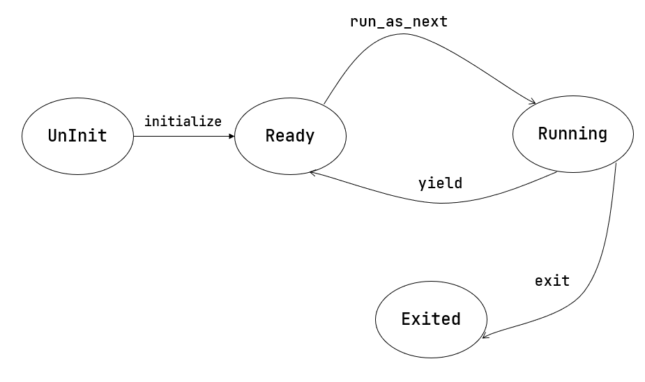

+ 多道程序放置
  
  注意到在第二章的时候，内存在任意时刻仅放置了一个应用程序，且只有在内存中的应用程序执行完之后，才会继续加载下一个应用程序到内存中执行，因此每个应用在被构建时的起始地址都是`0x80400000`，而在本章的多道程序的框架下，我们通过**提前加载应用程序到内存中，减少应用程序切换开销**，因此此时内存中将会同时存在多个等待运行的应用程序，但是此时我们尚未实现动态内存管理，因此每个应用程序需要知道自己运行时在内存中的不同位置，且操作系统也要知道每个应用程序运行时的位置，不能任意移动应用程序所在的内存空间

  由于我们现在编译应用程序时会规定应用程序的整体布局，因此实际上我们编写的是一种绝对代码，**并没有做到与位置无关，内核也没有提供相应的重定位机制**，即应用知道自己会被加载到某一个地址运行，而内核也确实能做到将应用程序加载到它指定的那个地址

  补充：

  + 程序和内存位置

    1. 绝对代码：一般来说程序的内存位置是在链接时刻确定的，以前的程序员甚至在程序中使用绝对地址来进行内存访问，这两种代码被称之为绝对代码
    2. 可重定位代码：后来一种“自重定位”的特殊程序被开发实现，这种程序可以把自己重定位到其他内存位置，然后再开始真正的运行，这种重定位类型被称之为“**运行时重定位**”，但是目标内存位置是否空闲，这并非是程序本身能够感知到的，因此后面又实现了“**加载时重定位**”的程序，具体地，加载器会申请一个空闲的内存位置，然后将程序加载到这个内存位置，之后再执行这个程序
    3. 位置无关代码：程序中的所有寻址都是针对程序位置来进行相对寻址操作的，这样的程序可以被加载到任意位置执行，而不会出现绝对代码的问题，同时也解决了“加载时重定位”在多次加载程序时产生的开销，现在这种技术常用在动态链接库上，位置无关代码的思想还可使得多个应用共享内存中的一段代码，唯一缺点是需要设置GOT表，访问地址时通过GOT表获取实际地址，再进行访址操作，即至少需要访问两次地址
   
+ 任务切换
  
  任务切换本质上就是让操作系统支持“**任务暂停**”和“**继续之前暂停的任务**”，显然，一旦一条控制流涉及到需要支持“暂停-继续”，就需要提供一种控制流切换的机制，而且需要保证程序执行的控制流被切换出去之前和切换回来之后，能够继续正确执行，这需要让程序执行的状态（也被称之为上下文）在切换后能够以某种形式保存起来，此前我们已经接触过函数调用上下文以及系统调用上下文，为了支持任务切换，我们需要引入任务上下文的概念

  ```Rust
  // os/src/task/context.rs

  pub struct TaskContext {
      ra: usize,
      sp: usize,
      s: [usize; 12],
  }
  ```

  任务上下文的数据结构如上，可以看出其和Trap上下文还是有很大的不同，其中，`ra`表示了在完成任务切换之后，应该跳转到哪里继续执行，而s实际上保存的是通用寄存器`s0-s11`中的内容，不用保存其他寄存器是因为，其它寄存器有些属于调用者保存的寄存器，有些属于临时寄存器，不需要保存或者和恢复，为什么和调用函数有关？这是因为任务切换本质是一个特殊的**函数调用**，其特殊之处在于，相较于普通的函数调用，任务切换还需要切换内核栈，即`sp`字段保存的数据为**对应任务的内核栈栈顶地址**（为了实现方便，每个任务均占有一个独立的内核栈），那么任务切换是怎样实现任务上下文的切换呢？

  实际上任务切换是来自两个不同应用在内核中的Trap控制流之间的切换，当一个应用陷入到Trap中时，Trap控制流可以调用一个特殊的`__switch`函数，`__switch`函数的整体流程如下：

  

  `__switch`函数总共接收两个参数，第一个参数表示当前任务的上下文，第二个参数表示即将要切换的任务上下文，其执行过程一共可以分为四个阶段：

  1. 在 Trap 控制流 A 调用 __switch 之前，A 的内核栈上只有 Trap 上下文和 Trap 处理函数的调用栈信息，而 B 是之前被切换出去的；

  2. A 在 A 任务上下文空间在里面保存 CPU 当前的寄存器快照；

  3. 这一步极为关键，读取 next_task_cx_ptr 指向的 B 任务上下文，根据 B 任务上下文保存的内容来恢复 ra 寄存器、s0~s11 寄存器以及 sp 寄存器。只有这一步做完后， __switch 才能做到一个函数跨两条控制流执行，即 通过换栈也就实现了控制流的切换；

  4. 上一步寄存器恢复完成后，可以看到通过恢复 sp 寄存器换到了任务 B 的内核栈上，进而实现了控制流的切换。这就是为什么 __switch 能做到一个函数跨两条控制流执行。此后，当 CPU 执行 ret 汇编伪指令完成 __switch 函数返回后，任务 B 可以从调用 __switch 的位置继续向下执行。
  
  ```S
  # os/src/task/switch.S

  .altmacro
  .macro SAVE_SN n
      sd s\n, (\n+2)*8(a0)
  .endm
  .macro LOAD_SN n
      ld s\n, (\n+2)*8(a1)
  .endm
      .section .text
      .globl __switch
  __switch:
      # 阶段 [1]
      # __switch(
      #     current_task_cx_ptr: *mut TaskContext,
      #     next_task_cx_ptr: *const TaskContext
      # )
      # 阶段 [2]
      # save kernel stack of current task
      sd sp, 8(a0)
      # save ra & s0~s11 of current execution
      sd ra, 0(a0)
      .set n, 0
      .rept 12
          SAVE_SN %n
          .set n, n + 1
      .endr
      # 阶段 [3]
      # restore ra & s0~s11 of next execution
      ld ra, 0(a1)
      .set n, 0
      .rept 12
          LOAD_SN %n
          .set n, n + 1
      .endr
      # restore kernel stack of next task
      ld sp, 8(a1)
      # 阶段 [4]
      ret
  ```

  那么考虑如何初始化任务上下文呢？只需将每个任务的内核栈的Trap上下文部分初始化，以及将`ra`字段设置为`__restore`函数的位置即可

  ```Rust
  for (i, task) in tasks.iter_mut().enumerate() {
    task.task_cx = TaskContext::goto_restore(init_app_cx(i));
    task.task_status = TaskStatus::Ready;
  }
  ```

+ 协作式调度
  
  暂时考虑CPU只能单向地通过读取外设提供的寄存器信息来获取外设处理I/O的完成状态，多道程序的思想在于：内核同时管理多个应用，如果外设处理I/O的时间足够长，那么我们可以切换任务取执行其他应用，并在下一次切换回来时检查I/O是否已经完成，这种任务切换，是通过应用主动调用`sys_yield`系统调用来实现的，这也正是“协作式”的含义，一种多道程序执行的典型情况如下：

  

  显然这种协作式的调度会影响到应用的响应延迟，但是暂时不考虑，同时我们还需要知道每一个任务的状态：

  ```Rust
  // os/src/task/task.rs

  #[derive(Copy, Clone, PartialEq)]
  pub enum TaskStatus {
      UnInit, // 未初始化
      Ready, // 准备运行
      Running, // 正在运行
      Exited, // 已退出
  }
  ```

  补充：通过 `#[derive(...)]` 可以让编译器为你的类型提供一些 Trait 的默认实现。实现了 Clone Trait 之后就可以调用 clone 函数完成拷贝；实现了 PartialEq Trait 之后就可以使用 == 运算符比较该类型的两个实例，从逻辑上说只有 两个相等的应用执行状态才会被判为相等，而事实上也确实如此；Copy 是一个标记 Trait，决定该类型在按值传参/赋值的时候采用移动语义还是复制语义。

  结合前面的任务上下文，我们可以得到任务控制块：

  ```Rust
  // os/src/task/task.rs

  #[derive(Copy, Clone)]
  pub struct TaskControlBlock {
      pub task_status: TaskStatus,
      pub task_cx: TaskContext,
  }
  ```

  有了任务控制块之后，我们就可以定义任务管理器了：

  ```Rust
  // os/src/task/mod.rs

  lazy_static! {
      pub static ref TASK_MANAGER: TaskManager = {
          let num_app = get_num_app();
          let mut tasks = [
              TaskControlBlock {
                  task_cx: TaskContext::zero_init(),
                  task_status: TaskStatus::UnInit
              };
              MAX_APP_NUM
          ];
          for i in 0..num_app {
              tasks[i].task_cx = TaskContext::goto_restore(init_app_cx(i));
              tasks[i].task_status = TaskStatus::Ready;
          }
          TaskManager {
              num_app,
              inner: unsafe { UPSafeCell::new(TaskManagerInner {
                  tasks,
                  current_task: 0,
              })},
          }
      };
  }
  ```

  下面我们主要关心任务管理器中最重要的方法`run_next_task`的实现：

  ```Rust
  impl TaskManager {
      fn run_next_task(&self) {
          if let Some(next) = self.find_next_task() {
              let mut inner = self.inner.exclusive_access();
              let current = inner.current_task;
              inner.tasks[next].task_status = TaskStatus::Running;
              inner.current_task = next;
              let current_task_cx_ptr = &mut inner.tasks[current].task_cx as *mut TaskContext;
              let next_task_cx_ptr = &inner.tasks[next].task_cx as *const TaskContext;
              drop(inner);
              // before this, we should drop local variables that must be dropped manually
              unsafe {
                  __switch(
                      current_task_cx_ptr,
                      next_task_cx_ptr,
                  );
              }
              // go back to user mode
          } else {
              panic!("All applications completed!");
          }
      }
  }
  ```

  可以看出在调用`__switch`函数前，我们需要先手动`drop(inner)`这是因为如果不手动`drop`的话，编译器会在`__switch`返回时，也就是当前应用被切换回来的时候才`drop`，这期间我们都不能修改`TaskManagerInner`，甚至不能读（因为之前是可变借用），会导致内核`panic`报错退出。正因如此，我们需要在`__switch`前提早手动`drop`掉`inner`。

  

  