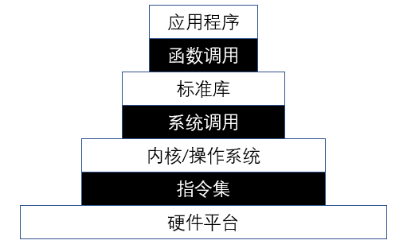
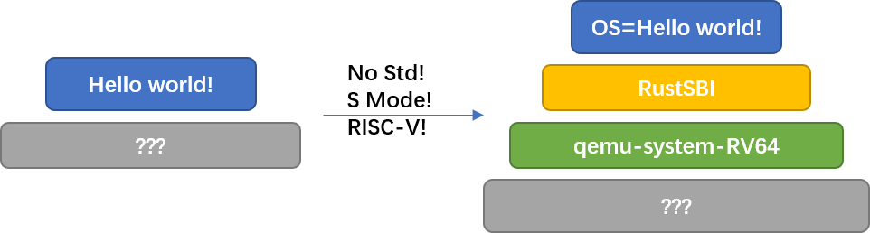

# Ch1

+ 理解应用程序执行环境

  在现代通用操作系统（如Linux）上运行应用程序，需要多层次的执行环境栈支持：

  

  应用程序通过调用标准库或者第三方库提供的接口，仅需要少量源代码就可以完成复杂的功能，例如程序调用的`println!`宏就是由Rust标准库std和GNU Libc等提供的，这些库属于程序的执行环境，而他们的实现又依赖于系统提供的系统调用

+ 平台与目标三元组
  
  编译器在编译、链接得到可执行文件时需要知道，程序要在哪个平台上运行，目标三元组描述了目标平台的CPU指令集、操作系统类型和标准运行时库，例如`x86_64-unknown-linux-gnu`，表示CPU架构是x86_64，CPU厂商是unknown，操作系统是linux，运行时库是gnu libc，下面的实验中，我们需要把目标平台换成`riscv64gc-unknown-none-elf`上运行，是因为我们的目标是开发操作系统内核，而非在 linux 系统上运行的应用程序。

+ 裸机启动过程

  用QEMU加载内核程序的命令如下：

  ```console
  qemu-system-riscv64 \
            -machine virt \
            -nographic \
            -bios $(BOOTLOADER) \
            -device loader,file=$(KERNEL_BIN),addr=$(KERNEL_ENTRY_PA)
  ```

  + `-bios $(BOOTLOADER)`意味着硬件加载了一个BootLoader程序，即RustSBI
  + `-device loader, file=$(KERNEL_BIN),addr=$(KERNEL_ENTRY_PA)` 表示硬件内存中的特定位置 `$(KERNEL_ENTRY_PA)` 放置了操作系统的二进制代码 `$(KERNEL_BIN)` 。 `$(KERNEL_ENTRY_PA)` 的值是 0x80200000 。

  当我们执行上述命令时，就意味着给这台虚拟的RISC-V64计算机加电了，此时CPU的其他通用寄存器会清零，而PC会指向 `0x100` 的位置，这里有固化在硬件中的一小段引导代码，很快就会跳到RustSBI处，RustSBI完成硬件初始化之后，就会跳到 `$(KERNEL_BIN)` 所在的内存位置处，执行操作系统的第一条指令

  

+ 实现关机功能

  通过以下代码可以实现关机功能：

  ```rust
  // os/src/sbi.rs
  fn sbi_call(which: usize, arg0: usize, arg1: usize, arg2: usize) -> usize {
  let mut ret;
    unsafe {
        core::arch::asm!(
            "ecall",
  ...

  const SBI_SHUTDOWN: usize = 8;

  pub fn shutdown() -> ! {
      sbi_call(SBI_SHUTDOWN, 0, 0, 0);
      panic!("It should shutdown!");
  }

  // os/src/main.rs
  #[no_mangle]
  extern "C" fn _start() {
      shutdown();
  }
  ```

  应用程序访问操作系统提供的系统调用指令是 `ecall` ，操作系统访问RustSBI提供的SBI调用的指令也是 `ecall` ，虽然指令一样，但是它们所处在的特权级并不相同，**应用程序位于最弱的用户特权 User Mode；操作系统位于内核特权级 Supervisor Mode；RustSBI位于机器特权级 Machine Mode**

  但当我们真正去编译运行上述代码，会发现关机失败，这是因为 `os_test` 可执行文件的入口地址并非RustSBI规定的 `0x80200000` ，因此我们需要修改程序的内存布局并设置好栈空间，前者可以通过修改Cargo的配置文件来使用我们自己的链接脚本，使得程序的内存布局符合我们的预期，后者我们可以使用一段汇编代码来初始化栈空间：

  ```asm
    .section .text.entry
    .global _start
  _start:
      la sp, boot_stack_top
      call rust_main

      .section .bss.stack
      .global boot_stack
  boot_stack:
      .space 4096 * 16
      .global boot_stack_top
  boot_stack_top:
  ```

  在入口地址 `_start` 的第一条指令便是将sp设置为栈顶地址，在第八行，我们设置了一个块大小为 4096 * 16字节的空间，作为操作系统的栈空间，栈顶地址被全局符号 `boot_stack_top` 标识，`boot_stack` 则标识栈底地址，这块栈空间被命名为 `.bss.stack`