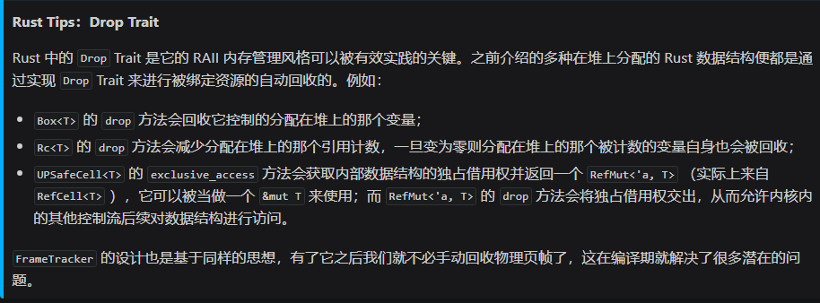
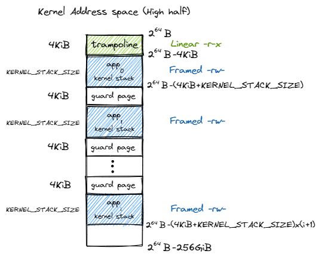
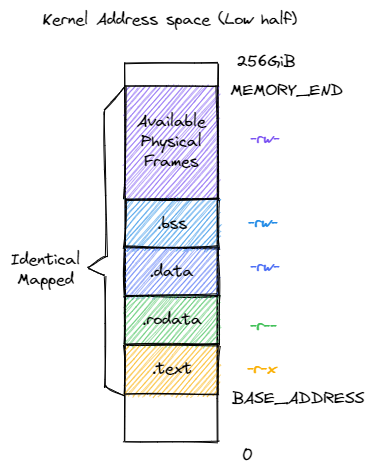
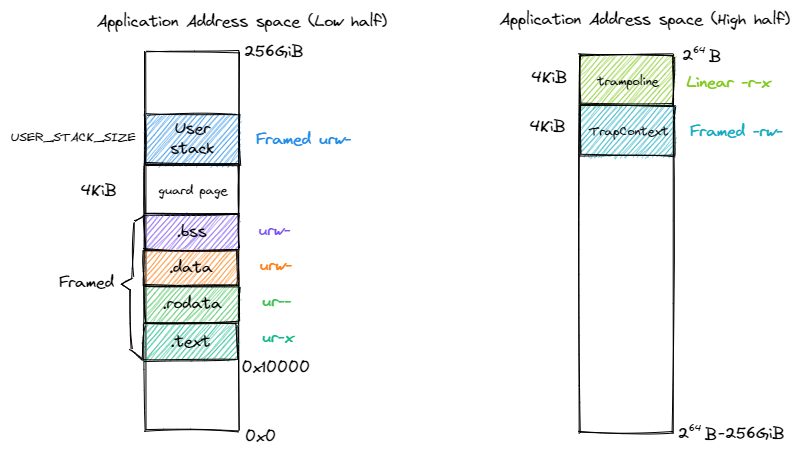

+ Rust中的堆数据结构

  Rust的标准库中有很多开箱即用的堆数据结构，利用它能够大大提升我们的开发效率：
  + 裸指针`*const T/ *mut T`基本等价于C/C++里面的普通指针`T*`最灵活也最不安全
  + 引用`&T/&mut T`实质上是一个地址范围，但是通过Rust的借用检查可以解决掉很多内存不安全的问题
  + 智能指针，不仅包含它指向区域的地址范围，还会有一些额外的信息，从用途上看，不仅作为一个访问数据的媒介，同时还兼具管理和控制的功能
  
  Rust智能指针/容器的内存布局如下：

  

  在Rust中，与动态内存分配相关的智能指针有：
  + `Box<T>`在堆上分配一个类型为`T`的变量，自身也只保存堆上那个变量的位置，当`Box<T>`被回收时，变量也会被回收，对标C++的`std::unique_ptr`
  + `Rc<T>`是一个在单线程上使用的引用计数类型，提供多所有权支持，既可以存在多个智能指针指向同一个堆上变量的`Rc<T>`，他们都可以拿到指向变量的不可变引用，事实上在堆上的另一个位置维护了这个变量目前被引用的次数 N ，即存在 N 个`Rc<T>`智能指针。这个计数会随着`Rc<T>`智能指针的创建或复制而增加，并在`Rc<T>`智能指针生命周期结束时减少。当这个计数变为零之后，这个智能指针变量本身以及被引用的变量都会被回收.`Arc<T>`与`Rc<T>`功能相同，只是`Arc<T>`可以在多线程上使用。`Arc<T>`类似于 C++ 的`std::shared_ptr` 
  + `RefCell<T>`与`Box<T>`等智能指针不同，其**借用检查**在运行时进行。对于 `RefCell<T>`，如果违反借用规则，程序会编译通过，但会在运行时`panic`并退出。使用`RefCell<T>`的好处是，可在其自身是不可变的情况下修改其内部的值。在Rust语言中，在不可变值内部改变值是一种**内部可变性**的设计模式，本身只能在单线程上运行
  + `Mutex<T>`是一个互斥锁，它可以保护里层的堆上数据同一时间上只有一个线程能对它进行操作，从而避免数据竞争，那么如何使`Mutex<T>`能够被多个线程同时持有？这就需要借助前面说到的`Arc<T>`了，`Arc<Mutex<T>>`是一种经典组合，本质上是`RefCell<T>`的多线程版本
  
  有了智能指针就可以实现更加强大的`集合`或者说是`容器`类型了，Rust中常见的有：`Vec<T>`和`String`等，

+ 内存控制相关的CSR寄存器
  
  默认情况下，MMU不会被使能，此时访存的地址都会作为一个物理地址交给对应的内存控制单元来直接访问物理内存，我们可以通过修改S特权级的一个名为`satp`的CSR来启用分页模式，在这之后，S和U特权级的访存地址会被视为一个虚拟地址

  重温SV39分页机制：

  
  
  页表项：

  

  Va to Pa：

  

  代码实现如下：

  ```Rust
  // os/src/mm/address.rs

  #[derive(Copy, Clone, Ord, PartialOrd, Eq, PartialEq)]
  pub struct PhysAddr(pub usize);

  #[derive(Copy, Clone, Ord, PartialOrd, Eq, PartialEq)]
  pub struct VirtAddr(pub usize);

  #[derive(Copy, Clone, Ord, PartialOrd, Eq, PartialEq)]
  pub struct PhysPageNum(pub usize);

  #[derive(Copy, Clone, Ord, PartialOrd, Eq, PartialEq)]
  pub struct VirtPageNum(pub usize);

  // os/src/mm/address.rs

  const PA_WIDTH_SV39: usize = 56;
  const PPN_WIDTH_SV39: usize = PA_WIDTH_SV39 - PAGE_SIZE_BITS;

  impl From<usize> for PhysAddr {
      fn from(v: usize) -> Self { Self(v & ( (1 << PA_WIDTH_SV39) - 1 )) }
  }
  impl From<usize> for PhysPageNum {
      fn from(v: usize) -> Self { Self(v & ( (1 << PPN_WIDTH_SV39) - 1 )) }
  }

  impl From<PhysAddr> for usize {
      fn from(v: PhysAddr) -> Self { v.0 }
  }
  impl From<PhysPageNum> for usize {
      fn from(v: PhysPageNum) -> Self { v.0 }
  }
  ```

  补充：当我们为U实现了`From<T>`之后，Rust会自动为T实现`Into<U>`Trait，此外当我们在调用`.into()`方法时，我们必须要显式指出目标类型`let y: T = `

+ 快表（TLB）
  
  按照上述介绍实现了SV39页表机制之后，将一个虚拟地址转化为物理地址需要访问3次物理内存，得到物理内存之后还需要再访问一次物理内存，才能完成访存，这无疑再很大程度上降低了系统执行效率，MMU中的快表（TLB）通过缓存最近的`vaTopa pair`来解决这个问题，到这我们仍然是对单个应用的多级页表进行了介绍，考虑在一个多任务系统中，可能同时存在多个任务处于运行/就绪状态，这时每次切换任务的时候，需要额外进行两个操作，一是切换页表，二是清空TLB中的指令缓存

+ 物理页帧的管理
  
  以下内容主要是学习其设计思想：首先我们将声明一个`FrameAllocator`Trait来描述一个物理页管理器需要提供的功能：

  ```Rust
  // os/src/mm/frame_allocator.rs

  trait FrameAllocator {
      fn new() -> Self;
      fn alloc(&mut self) -> Option<PhysPageNum>;
      fn dealloc(&mut self, ppn: PhysPageNum);
  }
  ```
  
  然后我们实现一个最简单的栈式物理页管理策略`StackFrameAllocator`：

  ```Rust
  // os/src/mm/frame_allocator.rs

  pub struct StackFrameAllocator {
      current: usize,  //空闲内存的起始物理页号
      end: usize,      //空闲内存的结束物理页号
      recycled: Vec<usize>,
  }
  ```

  其中各字段的含义是：物理页号[`current`，`end`)此前从未被分配出去过，而向量`recycled`以后入先出的方式保存了被回收的物理页号，核心的物理页帧分配和回收的实现如下：

  ```Rust
  // os/src/mm/frame_allocator.rs

  impl FrameAllocator for StackFrameAllocator {
      fn alloc(&mut self) -> Option<PhysPageNum> {
          if let Some(ppn) = self.recycled.pop() {
              Some(ppn.into())
          } else {
              if self.current == self.end {
                  None
              } else {
                  self.current += 1;
                  Some((self.current - 1).into())
              }
          }
      }
      fn dealloc(&mut self, ppn: PhysPageNum) {
          let ppn = ppn.0;
          // validity check
          if ppn >= self.current || self.recycled
              .iter()
              .find(|&v| {*v == ppn})
              .is_some() {
              panic!("Frame ppn={:#x} has not been allocated!", ppn);
          }
          // recycle
          self.recycled.push(ppn);
      }
  }
  ```

  同样使用`lazy_static!`宏声明一个全局的`StackFrameAllocator`实例：

  ```Rust
  // os/src/mm/frame_allocator.rs

  use crate::sync::UPSafeCell;
  type FrameAllocatorImpl = StackFrameAllocator;
  lazy_static! {
      pub static ref FRAME_ALLOCATOR: UPSafeCell<FrameAllocatorImpl> = unsafe {
          UPSafeCell::new(FrameAllocatorImpl::new())
      };
  }
  ```

  补充：`static`的初始化表达式必须得是常量，而`static ref`可以在初始化式使用复杂表达式，且必须配合`lazy_static!`宏使用，全局物理页帧管理器的初始化如下：

  ```Rust
  // os/src/mm/frame_allocator.rs

  pub fn init_frame_allocator() {
      extern "C" {
          fn ekernel();
      }
      FRAME_ALLOCATOR
          .exclusive_access()
          .init(PhysAddr::from(ekernel as usize).ceil(), PhysAddr::from(MEMORY_END).floor());
  }
  ```

  公开给其他内核模块调用的分配/回收物理页帧的接口：
  ```Rust
  // os/src/mm/frame_allocator.rs

  pub fn frame_alloc() -> Option<FrameTracker> {
      FRAME_ALLOCATOR
          .exclusive_access()
          .alloc()
          .map(|ppn| FrameTracker::new(ppn))
  }

  fn frame_dealloc(ppn: PhysPageNum) {
      FRAME_ALLOCATOR
          .exclusive_access()
          .dealloc(ppn);
  }
  ```

  可以发现，`frame_alloc`的返回值并不是`PhysPageNum`而是又进行了一步包装为一个`FrameTracker`，这里借用了RAII的思想，将一个物理页帧的生命周期绑定到一个`FrameTracker`变量上

  ```Rust
  // os/src/mm/frame_allocator.rs

  pub struct FrameTracker {
      pub ppn: PhysPageNum,
  }

  impl FrameTracker {
      pub fn new(ppn: PhysPageNum) -> Self {
          // page cleaning
          let bytes_array = ppn.get_bytes_array();
          for i in bytes_array {
              *i = 0;
          }
          Self { ppn }
      }
  }

  impl Drop for FrameTracker {
    fn drop(&mut self) {
        frame_dealloc(self.ppn);
    }
  } 
  ```

  只需为其实现`Drop`Trait的`drop`方法，那么当一个`FrameTracker`实例被回收时，`drop`方法会自动被编译器调用，显然这样做的好处是，我们不需要 **每时每刻都考虑有没有回收一个物理页了**

  

  总而言之，在其他模块眼中，物理页帧的接口是调用`frame_alloc`函数得到一个`FrameTracker`，当他的生命周期结束时，他所控制的物理页帧也将被回收

+ 多级页表管理
  
  显然SV39多级页表是以节点为单位进行管理的，每个节点都恰好存储在一个物理页帧中：

  ```Rust
  // os/src/mm/page_table.rs

  pub struct PageTable {
      root_ppn: PhysPageNum,
      frames: Vec<FrameTracker>,
  }

  impl PageTable {
      pub fn new() -> Self {
          let frame = frame_alloc().unwrap();
          PageTable {
              root_ppn: frame.ppn,
              frames: vec![frame],
          }
      }
  }
  ```

  每个应用的地址空间都会对应一个不同的页表，这就意味着不同页表的起始地址是不一样的，而向量`frames`保存了页表下的所有节点，包括`root_ppn`，实际上是将`FrameTracker`的生命周期进一步绑定在了`PageTable`下，多级页表需要支持插入/删除键值对的操作，其方法签名如下：

  ```Rust
  // os/src/mm/page_table.rs

  impl PageTable {
      pub fn map(&mut self, vpn: VirtPageNum, ppn: PhysPageNum, flags: PTEFlags);
      pub fn unmap(&mut self, vpn: VirtPageNum);
  }
  ```

+ 内核访问物理页帧的方法
  
  ```Rust
  // os/src/mm/address.rs

    impl PhysPageNum {
        pub fn get_pte_array(&self) -> &'static mut [PageTableEntry] {
            let pa: PhysAddr = self.clone().into();
            unsafe {
                core::slice::from_raw_parts_mut(pa.0 as *mut PageTableEntry, 512)
            }
        }
        pub fn get_bytes_array(&self) -> &'static mut [u8] {
            let pa: PhysAddr = self.clone().into();
            unsafe {
                core::slice::from_raw_parts_mut(pa.0 as *mut u8, 4096)
            }
        }
        pub fn get_mut<T>(&self) -> &'static mut T {
            let pa: PhysAddr = self.clone().into();
            unsafe {
                (pa.0 as *mut T).as_mut().unwrap()
            }
        }
    }
  ```

+ 建立和拆除虚实地址的映射关系
  
  定义以下辅助函数：

  ```Rust
  // os/src/mm/address.rs

    impl VirtPageNum {
        pub fn indexes(&self) -> [usize; 3] {
            let mut vpn = self.0;
            let mut idx = [0usize; 3];
            for i in (0..3).rev() {
                idx[i] = vpn & 511;
                vpn >>= 9;
            }
            idx
        }
    }

    // os/src/mm/page_table.rs

    impl PageTable {
        fn find_pte_create(&mut self, vpn: VirtPageNum) -> Option<&mut PageTableEntry> {
            let idxs = vpn.indexes();
            let mut ppn = self.root_ppn;
            let mut result: Option<&mut PageTableEntry> = None;
            for i in 0..3 {
                let pte = &mut ppn.get_pte_array()[idxs[i]];
                if i == 2 {
                    result = Some(pte);
                    break;
                }
                if !pte.is_valid() {
                    let frame = frame_alloc().unwrap();
                    *pte = PageTableEntry::new(frame.ppn, PTEFlags::V);
                    self.frames.push(frame);
                }
                ppn = pte.ppn();
            }
            result
        }
        fn find_pte(&self, vpn: VirtPageNum) -> Option<&mut PageTableEntry> {
            let idxs = vpn.indexes();
            let mut ppn = self.root_ppn;
            let mut result: Option<&mut PageTableEntry> = None;
            for i in 0..3 {
                let pte = &mut ppn.get_pte_array()[idxs[i]];
                if i == 2 {
                    result = Some(pte);
                    break;
                }
                if !pte.is_valid() {
                    return None;
                }
                ppn = pte.ppn();
            }
            result
        }
    }
  ```

  再实现`map/unmap`函数就会很简单：

  ```Rust
  // os/src/mm/page_table.rs

    impl PageTable {
        /// Temporarily used to get arguments from user space.
        pub fn from_token(satp: usize) -> Self {
            Self {
                root_ppn: PhysPageNum::from(satp & ((1usize << 44) - 1)),
                frames: Vec::new(),
            }
        }
        pub fn translate(&self, vpn: VirtPageNum) -> Option<PageTableEntry> {
            self.find_pte(vpn)
                .map(|pte| {pte.clone()})
        }
    }
  ```

+ 实现地址空间的抽象
  
  + 逻辑段：一段连续地址的虚拟内存空间

    我们以逻辑段`MapArea`为单位描述一段连续地址的虚拟内存，所谓逻辑段，就是指地址空间中一段实际可用的地址连续的虚拟地址区间，该区间包含的所有虚拟页面都以一种相同的方式映射到物理页帧，具有可读/可写/可执行等属性

    ```Rust
    // os/src/mm/memory_set.rs

    pub struct MapArea {
        vpn_range: VPNRange,
        data_frames: BTreeMap<VirtPageNum, FrameTracker>,
        map_type: MapType,
        map_perm: MapPermission,
    }
    ```

    其中`VPNRange`描述一段虚拟页号的连续区间，表示该逻辑段在地址区间中的位置和长度，他是一个迭代器，`MapType`描述该逻辑段内的所有虚拟页面映射到物理页帧的同一种方式，他是一个枚举类型在当前内核中支持两种方式：

    ```Rust
    // os/src/mm/memory_set.rs

    #[derive(Copy, Clone, PartialEq, Debug)]
    pub enum MapType {
        Identical,
        Framed,
    }
    ```

    `Identical`即恒等映射，`MapPermission`表示控制该逻辑段的访问方式，是`PTEFlags`的一个子集：

    ```Rust
    // os/src/mm/memory_set.rs

    bitflags! {
        pub struct MapPermission: u8 {
            const R = 1 << 1;
            const W = 1 << 2;
            const X = 1 << 3;
            const U = 1 << 4;
        }
    }
    ```

  + 地址空间：一系列有关联的逻辑段
    
    `MemorySet`类型表示一系列具有关联的不一定连续的逻辑段，这种关联一般是指这些逻辑段组成的虚拟内存空间与一个运行的程序，**即这个运行的程序对代码和数据的直接访问限制在它关联的虚拟地址空间之内**，这样就将任务地址空间和内核的地址空间区分开来了：

    ```Rust
    // os/src/mm/memory_set.rs

    pub struct MemorySet {
        page_table: PageTable,
        areas: Vec<MapArea>,
    }
    ```

    它包含了该地址空间的多级页表`page_table`和一个逻辑段`MapArea`的向量`areas`，注意到`PageTable`下挂了所有多级页表所在的物理页帧，而每个`MapArea`下挂着对应逻辑段中的数据所在的物理页帧，这同样也是一种RAII风格，当`MemorySet`被回收之后，所有的物理页帧都会被回收，`MemorySet`的方法如下：

    ```Rust
    // os/src/mm/memory_set.rs

    impl MemorySet {
        pub fn new_bare() -> Self {
            Self {
                page_table: PageTable::new(),
                areas: Vec::new(),
            }
        }
        fn push(&mut self, mut map_area: MapArea, data: Option<&[u8]>) {
            map_area.map(&mut self.page_table);
            if let Some(data) = data {
                map_area.copy_data(&self.page_table, data);
            }
            self.areas.push(map_area);
        }
        /// Assume that no conflicts.
        pub fn insert_framed_area(
            &mut self,
            start_va: VirtAddr, end_va: VirtAddr, permission: MapPermission
        ) {
            self.push(MapArea::new(
                start_va,
                end_va,
                MapType::Framed,
                permission,
            ), None);
        }
        pub fn new_kernel() -> Self;
        /// Include sections in elf and trampoline and TrapContext and user stack,
        /// also returns user_sp and entry point.
        pub fn from_elf(elf_data: &[u8]) -> (Self, usize, usize);
    }
    ```

    `push`方法可以在当前地址空间上插入一个新的逻辑段，`new_kernel`可以生成内核的地址空间，`from_elf`分析应用的ELF文件格式的内容，解析出各数据段并生成对应的地址空间，显然在实现push方法时，还需要维护`PageTable`的映射关系：

    ```Rust
    // os/src/mm/memory_set.rs

    impl MapArea {
        pub fn new(
            start_va: VirtAddr,
            end_va: VirtAddr,
            map_type: MapType,
            map_perm: MapPermission
        ) -> Self {
            let start_vpn: VirtPageNum = start_va.floor();
            let end_vpn: VirtPageNum = end_va.ceil();
            Self {
                vpn_range: VPNRange::new(start_vpn, end_vpn),
                data_frames: BTreeMap::new(),
                map_type,
                map_perm,
            }
        }
        pub fn map(&mut self, page_table: &mut PageTable) {
            for vpn in self.vpn_range {
                self.map_one(page_table, vpn);
            }
        }
        pub fn unmap(&mut self, page_table: &mut PageTable) {
            for vpn in self.vpn_range {
                self.unmap_one(page_table, vpn);
            }
        }
        /// data: start-aligned but maybe with shorter length
        /// assume that all frames were cleared before
        pub fn copy_data(&mut self, page_table: &PageTable, data: &[u8]) {
            assert_eq!(self.map_type, MapType::Framed);
            let mut start: usize = 0;
            let mut current_vpn = self.vpn_range.get_start();
            let len = data.len();
            loop {
                let src = &data[start..len.min(start + PAGE_SIZE)];
                let dst = &mut page_table
                    .translate(current_vpn)
                    .unwrap()
                    .ppn()
                    .get_bytes_array()[..src.len()];
                dst.copy_from_slice(src);
                start += PAGE_SIZE;
                if start >= len {
                    break;
                }
                current_vpn.step();
            }
        }
    }

    // os/src/mm/memory_set.rs

    impl MapArea {
        pub fn map_one(&mut self, page_table: &mut PageTable, vpn: VirtPageNum) {
            let ppn: PhysPageNum;
            match self.map_type {
                MapType::Identical => {
                    ppn = PhysPageNum(vpn.0);
                }
                MapType::Framed => {
                    let frame = frame_alloc().unwrap();
                    ppn = frame.ppn;
                    self.data_frames.insert(vpn, frame);
                }
            }
            let pte_flags = PTEFlags::from_bits(self.map_perm.bits).unwrap();
            page_table.map(vpn, ppn, pte_flags);
        }
        pub fn unmap_one(&mut self, page_table: &mut PageTable, vpn: VirtPageNum) {
            match self.map_type {
                MapType::Framed => {
                    self.data_frames.remove(&vpn);
                }
                _ => {}
            }
            page_table.unmap(vpn);
        }
    }

    ```

    可以看出恒等映射时，物理页帧号和虚拟页帧号相等

+ 内核地址空间
  
  地址空间抽象的重要意思在于隔离，当内核让应用执行前，内核需要控制MMU使用这个应用的多级页表进行地址转换，在启用分页模式下，内核代码的访存地址也会被视为一个虚拟地址并需要经过MMU的地址转换，因此我们也需要为内核对应构造一个地址空间，除了仍然需要允许内核的各数据段能够被正常访问，还需要包含所有应用的内核栈以及一个**跳板**，软件看到的地址空间如下：

  

  可以看到跳板在最高的一个虚拟页面中，接下里从高到低放置每个应用的内核栈，内核栈大小由`KERNEL_STACK_SIZE`决定，且相邻两个内核栈之间还会预留一个**保护页面**，用来防止栈溢出，内核地址空间的低256GiB的布局如下：

  

  所有的逻辑段都是恒等映射，无需调整内核内存布局`os/src/linker.ld`也能够访问各个段，因此创建内核地址空间的代码如下：

  ```Rust
    // os/src/mm/memory_set.rs

    extern "C" {
        fn stext();
        fn etext();
        fn srodata();
        fn erodata();
        fn sdata();
        fn edata();
        fn sbss_with_stack();
        fn ebss();
        fn ekernel();
        fn strampoline();
    }

    impl MemorySet {
        /// Without kernel stacks.
        pub fn new_kernel() -> Self {
            let mut memory_set = Self::new_bare();
            // map trampoline
            memory_set.map_trampoline();
            // map kernel sections
            println!(".text [{:#x}, {:#x})", stext as usize, etext as usize);
            println!(".rodata [{:#x}, {:#x})", srodata as usize, erodata as usize);
            println!(".data [{:#x}, {:#x})", sdata as usize, edata as usize);
            println!(".bss [{:#x}, {:#x})", sbss_with_stack as usize, ebss as usize);
            println!("mapping .text section");
            memory_set.push(MapArea::new(
                (stext as usize).into(),
                (etext as usize).into(),
                MapType::Identical,
                MapPermission::R | MapPermission::X,
            ), None);
            println!("mapping .rodata section");
            memory_set.push(MapArea::new(
                (srodata as usize).into(),
                (erodata as usize).into(),
                MapType::Identical,
                MapPermission::R,
            ), None);
            println!("mapping .data section");
            memory_set.push(MapArea::new(
                (sdata as usize).into(),
                (edata as usize).into(),
                MapType::Identical,
                MapPermission::R | MapPermission::W,
            ), None);
            println!("mapping .bss section");
            memory_set.push(MapArea::new(
                (sbss_with_stack as usize).into(),
                (ebss as usize).into(),
                MapType::Identical,
                MapPermission::R | MapPermission::W,
            ), None);
            println!("mapping physical memory");
            memory_set.push(MapArea::new(
                (ekernel as usize).into(),
                MEMORY_END.into(),
                MapType::Identical,
                MapPermission::R | MapPermission::W,
            ), None);
            memory_set
        }
    }
  ```

  `new_kernel`将映射跳板和地址空间中最低256GiB中的内核逻辑段

+ 应用地址空间
  
  在前面三章中，每个应用连接脚本中的起始地址被要求是不同的，这样他们的代码和数据存放的位置才不会产生冲突，这是一种对于应用开发者很不方便的设计，现在借助地址空间的抽象，我们终于可以让所有应用程序都使用同样的起始地址，也就意味着**所有应用都可以使用同一个链接脚本了**：

  ```Rust
  /* user/src/linker.ld */

    OUTPUT_ARCH(riscv)
    ENTRY(_start)

    BASE_ADDRESS = 0x10000;

    SECTIONS
    {
        . = BASE_ADDRESS;
        .text : {
            *(.text.entry)
            *(.text .text.*)
        }
        . = ALIGN(4K);
        .rodata : {
            *(.rodata .rodata.*)
        }
        . = ALIGN(4K);
        .data : {
            *(.data .data.*)
        }
        .bss : {
            *(.bss .bss.*)
        }
        /DISCARD/ : {
            *(.eh_frame)
            *(.debug*)
        }
    }
  ```

  应用的内存空间布局如下：

  

  左侧给出了应用地址空间最低256GiB的布局：从`0x10000`开始向高地址放置应用内存布局中的各个逻辑段，最后放置带有一个保护页面的用户栈。这些逻辑段都是以`Framed`方式映射到物理内存的，从访问方式上来说都加上了 U 标志位代表 CPU 可以在 U 特权级也就是执行应用代码的时候访问它们。右侧则给出了最高的256GiB，可以看出它只是和内核地址空间一样将跳板放置在最高页，还将`Trap`上下文放置在次高页中，但是这两个都不包含U标志位，事实上他们在地址空间切换的时候才会发挥作用

  最后我们加载ELF格式的应用程序数据进行解析生成应用程序的地址空间：

  ```Rust
    // os/src/mm/memory_set.rs

    impl MemorySet {
        /// Include sections in elf and trampoline and TrapContext and user stack,
        /// also returns user_sp and entry point.
        pub fn from_elf(elf_data: &[u8]) -> (Self, usize, usize) {
            let mut memory_set = Self::new_bare();
            // map trampoline
            memory_set.map_trampoline();
            // map program headers of elf, with U flag
            let elf = xmas_elf::ElfFile::new(elf_data).unwrap();
            let elf_header = elf.header;
            let magic = elf_header.pt1.magic;
            assert_eq!(magic, [0x7f, 0x45, 0x4c, 0x46], "invalid elf!");
            let ph_count = elf_header.pt2.ph_count();
            let mut max_end_vpn = VirtPageNum(0);
            for i in 0..ph_count {
                let ph = elf.program_header(i).unwrap();
                if ph.get_type().unwrap() == xmas_elf::program::Type::Load {
                    let start_va: VirtAddr = (ph.virtual_addr() as usize).into();
                    let end_va: VirtAddr = ((ph.virtual_addr() + ph.mem_size()) as usize).into();
                    let mut map_perm = MapPermission::U;
                    let ph_flags = ph.flags();
                    if ph_flags.is_read() { map_perm |= MapPermission::R; }
                    if ph_flags.is_write() { map_perm |= MapPermission::W; }
                    if ph_flags.is_execute() { map_perm |= MapPermission::X; }
                    let map_area = MapArea::new(
                        start_va,
                        end_va,
                        MapType::Framed,
                        map_perm,
                    );
                    max_end_vpn = map_area.vpn_range.get_end();
                    memory_set.push(
                        map_area,
                        Some(&elf.input[ph.offset() as usize..(ph.offset() + ph.file_size()) as usize])
                    );
                }
            }
            // map user stack with U flags
            let max_end_va: VirtAddr = max_end_vpn.into();
            let mut user_stack_bottom: usize = max_end_va.into();
            // guard page
            user_stack_bottom += PAGE_SIZE;
            let user_stack_top = user_stack_bottom + USER_STACK_SIZE;
            memory_set.push(MapArea::new(
                user_stack_bottom.into(),
                user_stack_top.into(),
                MapType::Framed,
                MapPermission::R | MapPermission::W | MapPermission::U,
            ), None);
            // map TrapContext
            memory_set.push(MapArea::new(
                TRAP_CONTEXT.into(),
                TRAMPOLINE.into(),
                MapType::Framed,
                MapPermission::R | MapPermission::W,
            ), None);
            (memory_set, user_stack_top, elf.header.pt2.entry_point() as usize)
        }
    }
  ```

  注意在前面加载各个`program header`的时候，我们就已经维护了`max_end_vpn`记录目前涉及到的最大的虚拟页号，只需紧接着在它上面再放置一个保护页面和用户栈即可，返回时，不仅返回地址空间，同时还返回用户栈栈顶，以及程序入口点地址，方便后续创建应用的任务控制块

+ 创建内核地址空间
  
  引入一个全局实例：

  ```Rust
  // os/src/mm/memory_set.rs

    lazy_static! {
        pub static ref KERNEL_SPACE: Arc<UPSafeCell<MemorySet>> = Arc::new(unsafe {
            UPSafeCell::new(MemorySet::new_kernel()
        )});
    }
  ```

  在主函数中进行初始化：

  ```Rust
  // os/src/mm/mod.rs

    pub use memory_set::KERNEL_SPACE;

    pub fn init() {
        heap_allocator::init_heap();
        frame_allocator::init_frame_allocator();
        KERNEL_SPACE.exclusive_access().activate();
    }

    // os/src/mm/page_table.rs

    pub fn token(&self) -> usize {
        8usize << 60 | self.root_ppn.0
    }

    // os/src/mm/memory_set.rs

    impl MemorySet {
        pub fn activate(&self) {
            let satp = self.page_table.token();
            unsafe {
                satp::write(satp);
                asm!("sfence.vma");
            }
        }
    }
  ```

  这里有两个小的细节，必须确保`stap::write(stap)`和之后的指令在虚拟地址上是相邻的，但是显然我们现在处于内核之中，所有地址都是恒等映射，另一个则是`sfence.vma`是用来清空TLB的，这里我们需要阻碍所有在这条指令之后的访址指令

+ 跳板机制的实现
  
  实现分页机制之后，Trap上下文的保存与恢复也会有很大的不同，我们必须在这个过程中同时完成地址空间的切换。具体来说，当 __alltraps 保存 Trap 上下文的时候，我们必须通过修改 satp 从应用地址空间切换到内核地址空间，因为 trap handler 只有在内核地址空间中才能访问；同理，在 __restore 恢复 Trap 上下文的时候，我们也必须从内核地址空间切换回应用地址空间，因为应用的代码和数据只能在它自己的地址空间中才能访问，应用是看不到内核地址空间的。这样就要求地址空间的切换不能影响指令的连续执行，即要求应用和内核地址空间在切换地址空间指令附近是平滑的，因此我们需要改进我们的`__alltraps`和`__restore`，使得他们能够在保存和恢复上下文的同时也切换地址空间

    ```S
    # os/src/trap/trap.S

        .section .text.trampoline
        .globl __alltraps
        .globl __restore
        .align 2
    __alltraps:
        csrrw sp, sscratch, sp
        # now sp->*TrapContext in user space, sscratch->user stack
        # save other general purpose registers
        sd x1, 1*8(sp)
        # skip sp(x2), we will save it later
        sd x3, 3*8(sp)
        # skip tp(x4), application does not use it
        # save x5~x31
        .set n, 5
        .rept 27
            SAVE_GP %n
            .set n, n+1
        .endr
        # we can use t0/t1/t2 freely, because they have been saved in TrapContext
        csrr t0, sstatus
        csrr t1, sepc
        sd t0, 32*8(sp)
        sd t1, 33*8(sp)
        # read user stack from sscratch and save it in TrapContext
        csrr t2, sscratch
        sd t2, 2*8(sp)
        # load kernel_satp into t0
        ld t0, 34*8(sp)
        # load trap_handler into t1
        ld t1, 36*8(sp)
        # move to kernel_sp
        ld sp, 35*8(sp)
        # switch to kernel space
        csrw satp, t0
        sfence.vma
        # jump to trap_handler
        jr t1

    __restore:
        # a0: *TrapContext in user space(Constant); a1: user space token
        # switch to user space
        csrw satp, a1
        sfence.vma
        csrw sscratch, a0
        mv sp, a0
        # now sp points to TrapContext in user space, start restoring based on it
        # restore sstatus/sepc
        ld t0, 32*8(sp)
        ld t1, 33*8(sp)
        csrw sstatus, t0
        csrw sepc, t1
        # restore general purpose registers except x0/sp/tp
        ld x1, 1*8(sp)
        ld x3, 3*8(sp)
        .set n, 5
        .rept 27
            LOAD_GP %n
            .set n, n+1
        .endr
        # back to user stack
        ld sp, 2*8(sp)
        sret
    ```

  为了得到kernel_satp等字段，我们需要在trap上下文中添加新的字段：

  ```Rust
  // os/src/trap/context.rs

    #[repr(C)]
    pub struct TrapContext {
        pub x: [usize; 32],
        pub sstatus: Sstatus,
        pub sepc: usize,
        pub kernel_satp: usize,
        pub kernel_sp: usize,
        pub trap_handler: usize,
    }
  ```

  有关kernel的字段都是在应用初始化的时候由内核写入，且此后不会再改变

+ 建立跳板页面
  
  接下来，我们还需要考虑在切换页表后，指令能否连续执行，我们将 trap.S 中的整段汇编代码放置在 .text.trampoline 段，并在调整内存布局的时候将它对齐到代码段的一个页面中，这样，整段汇编代码都被放在一个物理页帧当中，且`__alltraps`恰好位于这个物理页帧的开头，而之前初始化应用和内核的地址空间时，我们都将虚拟地址的最高页面映射为了这个跳板页面，因此此时用户态虚拟地址空间和操作系统内核的内核态虚拟地址空间，在这个跳板页面上的映射方式是一致的，也就确保了指令能够连续执行

+ 加载和执行应用程序

  启用分页机制之后，任务控制块的初始化更改为如下：

  ```Rust
    // os/src/config.rs

    /// Return (bottom, top) of a kernel stack in kernel space.
    pub fn kernel_stack_position(app_id: usize) -> (usize, usize) {
        let top = TRAMPOLINE - app_id * (KERNEL_STACK_SIZE + PAGE_SIZE);
        let bottom = top - KERNEL_STACK_SIZE;
        (bottom, top)
    }

    // os/src/task/task.rs

    impl TaskControlBlock {
        pub fn new(elf_data: &[u8], app_id: usize) -> Self {
            // memory_set with elf program headers/trampoline/trap context/user stack
            let (memory_set, user_sp, entry_point) = MemorySet::from_elf(elf_data);
            let trap_cx_ppn = memory_set
                .translate(VirtAddr::from(TRAP_CONTEXT).into())
                .unwrap()
                .ppn();
            let task_status = TaskStatus::Ready;
            // map a kernel-stack in kernel space
            let (kernel_stack_bottom, kernel_stack_top) = kernel_stack_position(app_id);
            KERNEL_SPACE
                .exclusive_access()
                .insert_framed_area(
                    kernel_stack_bottom.into(),
                    kernel_stack_top.into(),
                    MapPermission::R | MapPermission::W,
                );
            let task_control_block = Self {
                task_status,
                task_cx: TaskContext::goto_trap_return(kernel_stack_top),
                memory_set,
                trap_cx_ppn,
                base_size: user_sp,
            };
            // prepare TrapContext in user space
            let trap_cx = task_control_block.get_trap_cx();
            *trap_cx = TrapContext::app_init_context(
                entry_point,
                user_sp,
                KERNEL_SPACE.exclusive_access().token(),
                kernel_stack_top,
                trap_handler as usize,
            );
            task_control_block
        }
    }
  ```  

+ 改进Trap处理
  
  改进`trap_handler`:

  ```Rust
  // os/src/trap/mod.rs

    fn set_kernel_trap_entry() {
        unsafe {
            stvec::write(trap_from_kernel as usize, TrapMode::Direct);
        }
    }

    #[no_mangle]
    pub fn trap_from_kernel() -> ! {
        panic!("a trap from kernel!");
    }

    #[no_mangle]
    pub fn trap_handler() -> ! {
        set_kernel_trap_entry();
        let cx = current_trap_cx();
        let scause = scause::read();
        let stval = stval::read();
        match scause.cause() {
            ...
        }
        trap_return();
    }
  ```

  注意在进入`trap_handler`之后，我们设置了`stvec`寄存器，简化了S态->S态的Trap处理：直接panic，新增`trap_return`

  ```Rust
  // os/src/trap/mod.rs

    fn set_user_trap_entry() {
        unsafe {
            stvec::write(TRAMPOLINE as usize, TrapMode::Direct);
        }
    }

    #[no_mangle]
    pub fn trap_return() -> ! {
        set_user_trap_entry();
        let trap_cx_ptr = TRAP_CONTEXT;
        let user_satp = current_user_token();
        extern "C" {
            fn __alltraps();
            fn __restore();
        }
        let restore_va = __restore as usize - __alltraps as usize + TRAMPOLINE;
        unsafe {
            asm!(
                "fence.i",
                "jr {restore_va}",
                restore_va = in(reg) restore_va,
                in("a0") trap_cx_ptr,
                in("a1") user_satp,
                options(noreturn)
            );
        }
        panic!("Unreachable in back_to_user!");
    }
  ```

  因此在当每个应用第一次获取CPU的使用权即将进入用户态执行的时候，它的内核栈顶存放着我们在内核加载应用时构造的第一个任务上下文：

    ```Rust
    // os/src/task/context.rs

    impl TaskContext {
        pub fn goto_trap_return() -> Self {
            Self {
                ra: trap_return as usize,
                s: [0; 12],
            }
        }
    }
    ```

