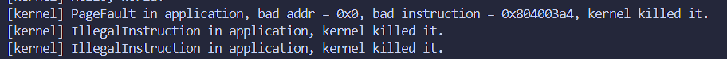

# 编程作业

实现功能：在`TaskManagerInner`结构体字段中添加新的字段，实现对每个任务使用的系统调用次数的跟踪，并添加新的系统调用`fn sys_trace(_trace_request: usize, _id: usize, _data: usize) -> isize`，根据参数`trace_request`的不同执行相应的操作：`trace_request=0`时读取并返回`id`地址处的值；`trace_request=1`时往`id`地址处写入`data`，返回`0`；`trace_request=2`时，查询当前任务调用编号为`id`的系统调用的次数，返回值为这个调用次数

# 简答作业

1. 在sbi版本为` 0.3.0-alpha.2,`的环境下，程序出错输出如下：
   
   

   可以看出第一个应用`ch2b_bad_address`因为访问了一个错误地址而被内核终止；第二个应用`ch2b_bad_instructions`试图在U态使用`sret`指令被内核识别到并终止；第三个应用`ch2b_bad_register`试图在U态访问S态下才能访问的状态寄存器`sstatus`被内核识别并被终止

2. + 此时`sp`代表内核栈的栈顶地址，`__restore`的第一种使用情景是当用户态发出一个系统调用请求之后，从内核态返回到用户态时需要执行`__restore`；第二种使用情景是在操作系统启动后第一次从内核态切换到用户态执行应用时，也会执行`__restore`
   + 这几行汇编代码恢复了陷入内核态之前`sstatus`、`sepc`和`sscratch`三个特殊寄存器。`sstatus`可以确保返回用户态时CPU的特权级和全局中断等状态和进入内核前一致，否则会导致权限错误；`sepc`恢复用户程序的PC，保证返回用户态后可以继续从被中断/异常位置继续执行；`sscratch`恢复用户栈指针
   + 在RISC-V架构中，`x2`是栈指针，已经通过专门的指令进行保存，`x4`是线程指针，内核不需要对其进行特殊管理
   + 此时`sp`变为用户栈指针，`sscratch`变为内核栈指针
   + 执行`sret`指令之后发生状态切换，`sret`执行时会修改CPU的特权级，此外还会将PC的值设置为寄存器`sepc`中的值，进而继续执行用户代码
   + 此时`sp`中的值为内核栈栈顶指针，`sscratch`的值为用户栈的栈指针
   + 在用户态执行`ecall`指令之后就会触发`__alltraps`

# 荣誉准则

在完成本次实验的过程（含此前学习的过程）中，我曾分别与 以下各位 就（与本次实验相关的）以下方面做过交流，还在代码中对应的位置以注释形式记录了具体的交流对象及内容：**无**

此外，我也参考了 以下资料 ，还在代码中对应的位置以注释形式记录了具体的参考来源及内容：**https://rcore-os.cn/rCore-Tutorial-Book-v3/chapter3/**

1. 我独立完成了本次实验除以上方面之外的所有工作，包括代码与文档。 我清楚地知道，从以上方面获得的信息在一定程度上降低了实验难度，可能会影响起评分。

2. 我从未使用过他人的代码，不管是原封不动地复制，还是经过了某些等价转换。 我未曾也不会向他人（含此后各届同学）复制或公开我的实验代码，我有义务妥善保管好它们。 我提交至本实验的评测系统的代码，均无意于破坏或妨碍任何计算机系统的正常运转。 我清楚地知道，以上情况均为本课程纪律所禁止，若违反，对应的实验成绩将按“-100”分计。